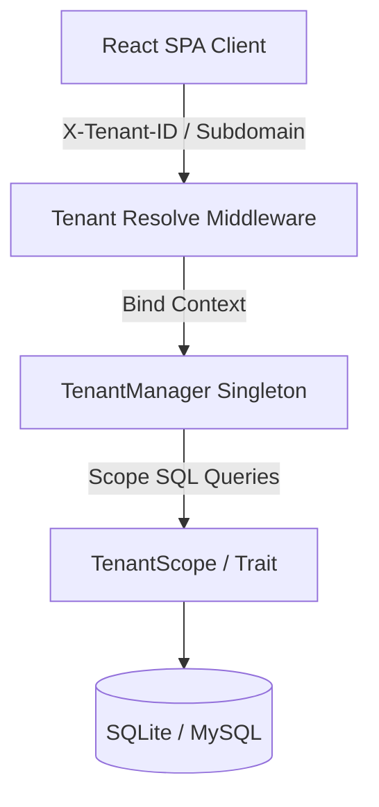

# EduCenter SaaS 🏗️
### Multi-Tenant Learning Center Management System

EduCenter SaaS is an enterprise-grade, cloud-ready Multi-Tenant Learning Center Management System designed to handle branches, students, schedules, financials, POS counter checkouts, and system audit logs in absolute isolation.

---

## 🏗️ System Architecture

The application is structured as a decoupled Single Page Application (SPA):
* **Backend:** Laravel 12 REST API utilizing token-based authentication (Sanctum) and multi-tenant database isolation.
* **Frontend:** React + Vite + TypeScript SPA styled with TailwindCSS v4.
* **Local Database:** SQLite (zero setup), fully prepared and tested for production-grade MySQL 8.x.



---

## 🔑 Demo Workspace Credentials

The database is pre-seeded with a comprehensive demo tenant environment. You can log in using:
* **Center Subdomain:** `elite`
* **Admin Email:** `admin@elite.com`
* **Password:** `password`

This demo tenant includes:
* **2 Branches** (Main Campus & North Branch) and Classrooms.
* **Academic Timetables** (Calculus & Physics schedules, with attendance marked).
* **Inventory Catalog** (Workbooks, lab kits, uniforms, and stock alert logs).
* **Financial Ledger** (Invoices, partial tuition payments, POS receipt checkouts, utility bills, and debit/credit ledger postings).

---

## 🚀 How to Run Locally

### 1. Start the Backend API
Run the following commands in your terminal:
```bash
cd backend
composer install
php artisan migrate
php artisan db:seed
php artisan serve
```
The backend API server will start running at `http://127.0.5.1:8000`.

### 2. Start the Frontend SPA
Open a new terminal window and run:
```bash
cd frontend
npm install
npm run dev
```
The frontend application will start running at `http://localhost:5173`. Open it in your browser and enter the demo credentials!

---

## 🧪 Running Automated Tests

To execute the test suite (Auth, Tenant isolation, Academic schedulers, Financial checkouts, search, uploads, and analytics):
```bash
cd backend
php artisan test
```

---

## 📂 Project Structure

* `/backend` — Laravel 12 API codebase
  * `/app/Http/Middleware/TenantResolveMiddleware.php` — Resolves subdomain or headers to active tenant
  * `/app/Tenant/TenantManager.php` — Singleton state tracker
  * `/app/Scopes/TenantScope.php` — Automatically restricts SQL queries to active tenant ID
  * `/app/Traits/BelongsToTenant.php` — Scopes Eloquent model query lifecycles
* `/frontend` — React SPA codebase
  * `/src/contexts/AuthContext.tsx` — Manages auth states and headers injection
  * `/src/components/ProtectedRoute.tsx` — Handles route guarding and Spatie RBAC permission checks
  * `/src/pages/Dashboard.tsx` — Dynamic metrics panels and SVG line charting
  * `/src/pages/POSRegister.tsx` — Counter POS register cash register interface
